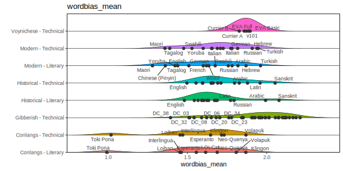

# Extended plots

## Summary plot for only "unknowledgeable" participants

Figure 1 in Gaskell & Bowern (2022) includes gibberish samples by the
experimenters and members of the 2019 class, who had more background knowledge
than the other participants on the statistical properties of the VMS. To rule
out data contamination issues due to these participants consciously or
unconsciously trying to imitate the VMS, the following version of Figure 1
includes only members of the less-knowledgable 2018 class and members of the
general public who were not aware of the study's connection to the VMS. (See
also extended discussion in the paper.)

## Individual variable distributions by category

